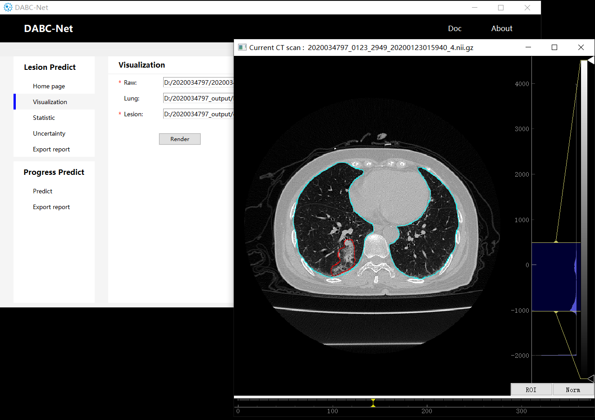

# DABC-Net

DABC-Net toolkit is designed for easy-to-use, fast and real-time segmentation.
It can provide insights of model performance to clinicians or medical experts by generating aleatory and epistemic uncertainty.

This repository provide an implementation of DABC-Net (including graphical user interface) and early triage of critically ill automatically.

<b>The main features:</b>
* Easy-to-use (You can run our toolkit with GUI and even no need to install Tensorflow or Python interpreter on you computer.)
* Run everywhere (Desktop app, Web or console)
* Fast segmentation
* Built-in multi-types uncertainty
* Early triage of critically ill automatically
* Support for Covid-19 longitudinal study

## Table of Contents
* [Installation](#installation)
* [Quick start](#quick-start)
    + [DABC-Net for desktop app](#dabc-net-for-desktop-app)
    + [DABC-Net for Colab](#dabc-net-for-colab)
    + [DABC-Net for Website](#dabc-net-for-website)
* [Progress prediction](#progress-prediction)
    + [Model](#model)
    + [Usage](#usage)   
    + [Visualization of progress](#visualization-of-progress)
* [Data](#data)
* [Tutorial](#tutorial)

## Installation
If you run toolkit with packaged destop app, you can skip this step.

An Nvidia GPU is needed for faster inference (about 16ms/slice on 1080ti gpu).

Requirements:

* tensorflow-gpu == 1.15.4
* Keras == 2.2.4
* numpy == 1.16
* scikit-learn == 0.21.3
* scikit-image == 0.14
* xgboost == 1.1.0
* simpleitk == 2.0
* scipy == 1.1

You need to download this repository and run following command:

```shell
cd path/to/repository/
pip install -r requirement.txt
```
The project folder looks like this:

```shell
path
├─Input_data
│      2020034797_0123_2949_20200123015940_4.nii.gz
│      2020034797_0125_3052_20200125111145_4.nii.gz
│      ...
│
├─Output_data
│   │
│   ├─covid
│   │      2020034797_0123_2949_20200123015940_4.nii.gz
│   │      2020034797_0125_3052_20200125111145_4.nii.gz
│   │      ...
│   │
│   ├─lung
│   │      2020034797_0123_2949_20200123015940_4.nii.gz
│   │      2020034797_0125_3052_20200125111145_4.nii.gz
│   │      ...
│   │
│   └─uncertainty
│           2020034797_0123_2949_20200123015940_4_predictive_aleatoric.nii.gz
│           2020034797_0125_3052_20200125111145_4_sample_1.nii.gz
│           ...
│
├─weight
│       model_05090017
│       ...
│
│ (following folders are required if you need longitudinal study)
│
├─meta
│       2020035021.csv
│
└─model
        prediction.pkl
        ...

```

## Quick Start

### DABC-Net for desktop app
#### Inference:
1. Download and double click the DABC_Net.exe(Windows) or DABC_Mac(Mac OS) file. 
You can run our network even without installing Tensorflow or Python interpreter on you computer. 
The UI looks like this:

   

2. Type or select the input folder where you store nii/nii.gz format CT scans data. The output results will be saved in the folder you specified.

3. Choose the sform code name,  the default value is 'NIFTI_XFORM_SCANNER_ANAT', some scans without complete header files may loss this value. For more details about header files, please see this [site](https://brainder.org/2012/09/23/the-nifti-file-format/  "With a Title"). 

4. Click 'Run' button. After all the inference done, the progress bar window will be closed. 
   
      
   
   Here are some examples:
   

#### Uncertainty:

In DABC-Net, we approximate Bayersian inference using [DropBlock](http://papers.nips.cc/paper/8271-dropblock-a-regularization-method-for-convolutional-networks), a form of Monte Carlo dropout. For more details about aleatory and epistemic uncertainty, please refer to this [paper](https://pdfs.semanticscholar.org/146f/8844a380191a3f883c3584df3d7a6a56a999.pdf).

1. Follow instructions from item(1-3) in the section above.

2. Choose sample times (integer, e.g. 10). The network will sample 10 times to  compute aleatory/epistemic uncertainty and get mean prediction outcome as final segmentation.

3. Set 'threshold' to get binary output if you need. The default value is 0.5. If you want to save raw probability map from the last sigmoid activation layer of the network, just set threshold  to 0.

4. 'Method' denotes what kind of uncertainty you  want to save.

   

   Here are some examples:

   

#### Visualization:

* Raw: original CT scan
* Lung: output of lung segmentation(optional)
* Lesion: output of lesion segmentation

Then, choose appropriate HU range (e.g. -1024~512) via right sliding window.



## DABC-Net for Colab
#### Inference:
1. Put your data in a folder.
2. Select the input and output folder, and run following command:
```
infer_colab(input_path, output_path)
```
- nii_path : 
    - Input: Folder path of input data(nii or nii.gz format).
    - Type: string
- save_path : Folder path of output data. The segmentation results will be saved as nii.gz format.
    - Input: Folder path of input data(nii or nii.gz format).
    - Type: string 
- usage
   - Input: Folder path of input data(nii or nii.gz format).
   - Type: string, 'lung' or 'covid'

#### Uncertainty:
```
infer_uncertainty(nii_filename, save_filename, sample_value, uncertainty='Aleatoric')
```
- nii_filename : 
    - Input: Path of input data(nii or nii.gz format).
    - Type: string
- save_filename :
    - Input: Folder path of input data(nii or nii.gz format).
    - Type: string 
- sample_value
   - Input: number of Monte carlo samples.
   - Type: int
- uncertainty:
   - Input: Choose uncertainty. The results will be saved as nii.gz format.
   - Type: string, 'Predictive','Aleatoric','Epistemic' or 'Both'   

For more detail, please refer to [notebook](https://drive.google.com/).

##  DABC-Net for Website
coming soon

# Progress prediction

## Model
### Feature
Feature we used:

| Feature                   | Scan |
| ------------------------- | ------------ |
| Left lesion volume        | scan0 & scan1|
| Left lung volume          | scan0 & scan1|
| Left lesion ratio         | scan0 & scan1|
| Left consolidation volume | scan0 & scan1|
| Left weighted volume      | scan0 & scan1|
| Left z-position           | scan0 & scan1|
| Right lesion volume       | scan0 & scan1|
| Right lung volume         | scan0 & scan1|
| Right lesion ratio        | scan0 & scan1|
| Right consolidation volume| scan0 & scan1|
| Right weighted volume     | scan0 & scan1|
| Right z-position          | scan0 & scan1|
| Age                       | scan0 & scan1|
| Sex		                | scan0 & scan1|

### Base learner
Base learners we used:

| Base learner | MinMaxScaler Necessity | Feature Importance |
| ------------ | ---------------------- | ------------------ |
|SVM			| True	| False	|
|MLP			| True	| False |
|Logistic Regression	| True 	| False |
|Naive Bayes		| False	| False |
|Random Forest		| False | True	|
|Adaboost		| False	| True	|
|Gradient Boost		| False	| True	|
|XGBoost		| False | True	|

#### MinMaxScalar
For base learners sensitive to data normalization(svm, mlp, ...), we provide the min max normalization based on our training dataset. The weights without min max scalar (TODO) are also provided with fewer base learners and lower performance.

## Usage
### Prediction
```python
pred = predict_base_learners(base_learners, feature)
```
- base_learners: 
   - Input: Trained base learners.
   - Type: dict, shape: {key: learner}, key: name of learner, learner: sklearn learner.
- feature: 
   - Input: Preprocessed features.
   - Type: array, shape: m x n, m: number of samples, n: number of features.
- pred: 
   - Output: Probability predicted of base learners. 
   - Type: array, shape: m x k, m: number of samples, k: number of base learners.

## Visualization of progress
Here are some examples:

#### Progression curve of severe patient：


#### Progression curve of mild patient：


x-axis: time(day), y-axis: lesion ratio

#####  Visualization of different timepoint scans


# Data

Dataset with Expert Annotations and Benchmark
* [1] - Ma Jun, Ge Cheng, Wang Yixin, An Xingle, Gao Jiantao, … He Jian. (2020). COVID-19 CT Lung and Infection Segmentation Dataset (Version Verson 1.0) [Data set]. Zenodo. [DOI](https://zenodo.org/record/3757476)

Data Sources
* [2] - Paiva, O., 2020. CORONACASES.ORG - Helping Radiologists To Help People In More Than 100 Countries! \| Coronavirus Cases - 冠状病毒病例. [online] Coronacases.org. Available at: [<link>](https://Coronacases.org) [Accessed 20 March 2020].
* [3] - Glick, Y., 2020. Viewing Playlist: COVID-19 Pneumonia \| Radiopaedia.Org. [online] Radiopaedia.org. Available at: [<link>](https://Radiopaedia.org) [Accessed 20 April 2020].

# Notes

Acknowledgements: We thank [COVID-19-CT-Seg-Benchmark repository](https://github.com/JunMa11/COVID-19-CT-Seg-Benchmark) for providing covid-19 segmentation dataset and benchmark. We also thank this [repository](https://github.com/EdwinZhang1970/Python/tree/master/tkinter-pack%20Demo) for providing us ideas for designing ui.

Disclaimer: This toolkit is only for research purpose and not approved for clinical use.
